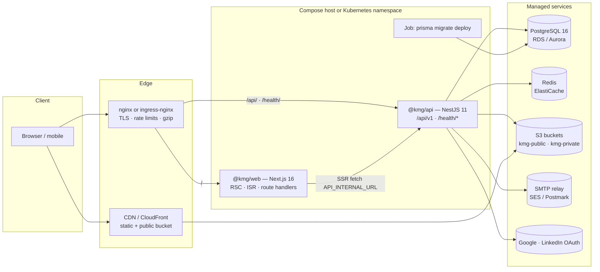
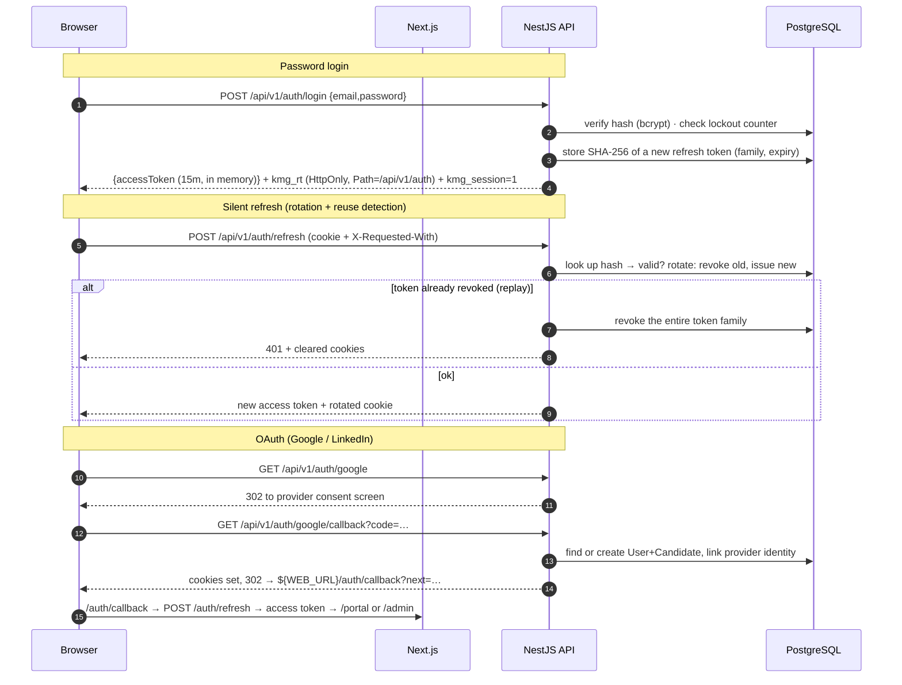
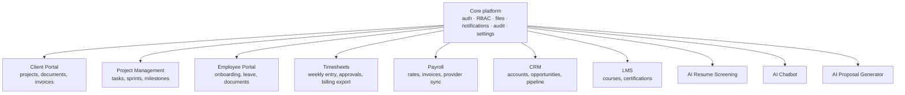

# Architecture

How the KmgTechnologies platform is put together, why, and how to extend it.
The endpoint-level contract lives in [API_CONTRACT.md](./API_CONTRACT.md).

## 1. System overview



Two stateless deployables. Everything that must survive a pod restart lives in
PostgreSQL, Redis or object storage — which is what makes horizontal scaling and
rolling deploys boring.

## 2. API layering (clean architecture, pragmatic)

```
apps/api/src/
├── main.ts                     # bootstrap: helmet, compression, cookie-parser, pino, Swagger, /api/v1 prefix
├── app.module.ts               # composition root
├── common/                     # cross-cutting, framework-facing
│   ├── decorators/             # @CurrentUser, @Permissions, @Public
│   ├── guards/                 # JwtAuthGuard, PermissionsGuard, ThrottlerGuard
│   ├── interceptors/           # response envelope, request-id, audit
│   ├── filters/                # ApiErrorBody exception filter
│   └── pipes/                  # ZodValidationPipe
├── infrastructure/             # the outside world, behind interfaces
│   ├── prisma/                 # PrismaService (connection lifecycle)
│   ├── storage/                # StorageService: S3Driver | LocalDriver
│   ├── mail/                   # MailService: SmtpDriver | LogDriver + Handlebars templates
│   ├── meeting/                # MeetingProvider: Jitsi (pluggable: Meet/Zoom/Teams)
│   └── health/                 # terminus indicators (db, storage)
└── modules/                    # one folder per bounded context
    ├── auth/ users/ candidates/ jobs/ applications/ interviews/
    ├── leads/ blog/ content/ settings/ notifications/ analytics/ uploads/ audit/
    └── …                       # controller → service → prisma, DTOs from @kmg/shared
```

Rules that keep it clean:

1. **Controllers** only translate HTTP ↔ domain: validate with a shared Zod schema, call one
   service method, return `{ data }`. No Prisma calls in a controller.
2. **Services** hold business rules and own their transaction boundaries. Cross-module effects go
   through domain events (`@nestjs/event-emitter`), never by reaching into another module's repository.
3. **Infrastructure is injected behind an interface** (`StorageService`, `MailService`,
   `MeetingProvider`) so drivers swap by configuration — and tests use fakes.
4. **`@kmg/shared` is the single source of truth** for enums, permissions, upload rules and request
   schemas, so the API and the web app can never disagree about a shape.

## 3. Request flow

```
Browser → nginx/ingress → Next.js → (rewrite /api/v1/*) → NestJS → Prisma → PostgreSQL
```

- The browser talks to **one origin**. Next.js rewrites `/api/v1/*` to `API_INTERNAL_URL`, and at the
  edge nginx routes `/api/` straight to the API (skipping a Next hop). Same-origin means the refresh
  cookie (`Path=/api/v1/auth`) works without third-party-cookie problems and CORS stays closed.
- **Server components** fetch from `API_INTERNAL_URL` in-cluster (no TLS hop, no public egress).
- **Client components** use TanStack Query against the same-origin `/api/v1`, with the access token
  held in memory only.
- Every response carries `X-Request-Id` (minted by nginx or the API) which is also in every log line,
  so a user-visible error can be traced across all three tiers.

### Auth flow



Middleware in Next.js reads the non-secret `kmg_session` hint cookie to decide whether to render a
portal shell or redirect to `/login` — cheap, and never trusted for authorization. Authorization is
always re-checked by the API from the JWT's `roles`/`perms` claims.

## 4. File storage

| Bucket        | Contents                               | Access                                                                             |
| ------------- | -------------------------------------- | ---------------------------------------------------------------------------------- |
| `kmg-public`  | logos, blog/case-study images, avatars | anonymous read; served via CDN (`S3_PUBLIC_URL`)                                   |
| `kmg-private` | résumés, cover letters                 | no public access; short-lived signed URLs (`SIGNED_URL_TTL_SECONDS`, default 300s) |

- Uploads are validated **before** they reach the bucket: purpose-specific size and MIME allow-list
  from `UPLOAD_RULES`, plus magic-byte sniffing (a `.pdf` that is really an executable is rejected).
- Objects are stored under opaque keys (`<purpose>/<cuid>.<ext>`); the database row (`files`) holds
  the original filename, size, MIME type, owner and visibility.
- `GET /api/v1/files/:id` authorizes first (owner candidate, or staff with `applications:read`),
  then 302s to a freshly signed URL. Nothing private is ever handed out as a stable link.
- The local driver (`STORAGE_DRIVER=local`) exists only so a laptop needs no MinIO.

## 5. Events and notifications

In-process domain events (`@nestjs/event-emitter`) decouple the write path from the side effects:

| Event                           | Side effects                                                             |
| ------------------------------- | ------------------------------------------------------------------------ |
| `application.created`           | Email candidate + staff inbox, in-app notification for recruiters/HR     |
| `application.status_changed`    | Status email (or `offer.released`), in-app notification to the candidate |
| `interview.scheduled`           | Emails with an `.ics` attachment to candidate and interviewers           |
| `lead.created` / `assigned`     | Admin + visitor emails, notifications to Sales                           |
| `user.password_reset_requested` | Reset email with a single-use token                                      |

Handlers are idempotent and log failures instead of failing the originating request — a bounced
email must never roll back an application. When email volume or latency grows, the handlers move to a
queue (BullMQ on the existing Redis) without touching the emitting services.

## 6. Caching & rendering strategy

| Content                         | Strategy                                                               |
| ------------------------------- | ---------------------------------------------------------------------- |
| Marketing pages, services, team | ISR — `revalidate: 3600` + cache tags, rebuilt on demand after an edit |
| Blog list/detail, case studies  | ISR `revalidate: 300`, tag `blog`/`post:<slug>`                        |
| Job list & detail               | ISR `revalidate: 60` (freshness matters), tag `jobs`                   |
| Candidate portal, admin portal  | Fully dynamic, `no-store`, per-request auth                            |
| `/_next/static/*`               | Immutable, `max-age=31536000`, cached at nginx/CDN                     |
| Public bucket assets            | CDN, 7-day TTL                                                         |

Admin mutations call `revalidateTag()` through a route handler so an editor sees changes within
seconds instead of waiting for the TTL. Every page that depends on the API renders **fallback
content from `@kmg/shared`** when the API is unreachable, so an API incident degrades the marketing
site instead of taking it down.

API-side caching is deliberately minimal (Redis for rate-limit counters, short TTL caches for
facets and public settings) — correctness first, and Postgres is not the bottleneck at this size.

## 7. Scalability

- **Stateless pods.** No sticky sessions, no local session store, no local uploads in production.
  Both deployments run ≥3 replicas across zones with `topologySpreadConstraints` and a PDB.
- **HPA on CPU + memory** (70% / 80%) with a fast scale-up and a 5-minute scale-down window.
- **Database connections** are the real limit: Prisma pools per pod, so
  `?connection_limit=10&pool_timeout=20` is set in `DATABASE_URL` and **PgBouncer** (transaction
  pooling) sits in front of Postgres once replica count × pool exceeds `max_connections`.
  Long reports run against a read replica when they start to hurt.
- **Redis-backed throttling** (`@nest-lab/throttler-storage-redis`) so limits are global, not per pod.
  Without `REDIS_URL` the API falls back to an in-memory store, which is only correct for one replica.
- **CDN** in front of `/_next/static` and the public bucket removes most byte-serving from the pods.
- **Queue-ready**: heavy work (bulk CSV export, mass email) moves to BullMQ workers — a third
  deployment that shares the same image and code.

## 8. Observability

- **Structured logs**: `nestjs-pino` emits one JSON line per request with `requestId`, `userId`,
  method, route, status and duration; Next.js logs to stdout. Container stdout is collected by the
  platform (CloudWatch, Loki, Datadog) — nothing writes log files.
- **Request correlation**: nginx/ingress mints `X-Request-Id` when absent and passes it through;
  the API echoes it in every response and error body.
- **Health probes**: `/health/live` (process is up) and `/health/ready` (database, and storage when
  configured) drive Kubernetes probes, the container `HEALTHCHECK` and `depends_on` in compose.
- **Audit trail**: every mutating admin call writes an `AuditLog` row (actor, entity, before/after).
- **Next steps** (not yet wired): OpenTelemetry SDK in `main.ts` exporting traces via OTLP;
  `@willsoto/nestjs-prometheus` for `/metrics` plus the `ServiceMonitor` in
  `infra/k8s/base/servicemonitor.example.yaml`; Sentry for client and server error tracking;
  synthetic checks on `/health/ready` and the login flow.

## 9. Extending the platform

New capability = new module in `apps/api/src/modules/<name>` + route group in `apps/web/src/app` +
shared types/schemas + permissions in `ROLE_PERMISSIONS`. Because permissions are data
(`<resource>:<action>`) and the admin shell builds its navigation from the user's `perms`, a new
module becomes visible to exactly the right roles without touching the shell.



| Module                    | Plugs in as                                                                                                                                                                                                       |
| ------------------------- | ----------------------------------------------------------------------------------------------------------------------------------------------------------------------------------------------------------------- |
| **Client Portal**         | New `Client`/`ClientUser` relation to `User`; `clients:*` permissions; `/clients` route group reusing the portal shell and the private bucket for documents                                                       |
| **Project Management**    | `Project`, `Task`, `Milestone` tables linked to `Client`; emits `task.assigned` into the existing notification pipeline                                                                                           |
| **Employee Portal**       | `Employee` extends `User` (1:1); documents reuse the file pipeline; leave requests reuse the approval/notification pattern from applications                                                                      |
| **Timesheets**            | `Timesheet`/`TimeEntry` keyed by `Employee` + `Project`; weekly approval workflow mirrors application status history; CSV export reuses the export service                                                        |
| **Payroll**               | Reads approved timesheets, adds `PayRate`/`Invoice`; integrates a provider (Gusto/ADP) behind a `PayrollProvider` interface like `MeetingProvider`                                                                |
| **CRM**                   | `ContactLead` is already the seed: add `Account`, `Opportunity`, stages; Sales role gains `crm:*`                                                                                                                 |
| **LMS**                   | `Course`, `Enrollment`, `Certification` on `Candidate`/`Employee`; video assets in the public bucket                                                                                                              |
| **AI Résumé Screening**   | A worker consumes `application.created`, extracts text from the private-bucket résumé, scores it against the job and writes `ApplicationScore` + rationale; staff see a score badge, never an automatic rejection |
| **AI Chatbot**            | Route handler in Next.js streaming from an LLM provider, grounded in the published services/blog/jobs content; escalates to `POST /contact` as a lead                                                             |
| **AI Proposal Generator** | Admin-only tool: takes a lead + service templates, produces a draft proposal document into the private bucket for a human to edit                                                                                 |

**Multi-tenancy.** When the platform is offered to other agencies: add `tenantId` (indexed,
non-null) to every tenant-owned table, resolve the tenant from the host or the JWT into an
`AsyncLocalStorage` context, and enforce it in **one** place — a Prisma client extension that injects
`where: { tenantId }` on every query and `data: { tenantId }` on every write. Defence in depth adds
PostgreSQL row-level security (`USING (tenant_id = current_setting('app.tenant_id')::uuid)`) with the
setting applied per transaction, so a missed filter fails closed. Object keys get a `t/<tenantId>/`
prefix; rate-limit keys and cache tags get the tenant in the key.

**Internationalisation.** `next-intl` with locale-prefixed routing (`/[locale]/…`), messages per
namespace, and `hreflang`/canonical alternates in the sitemap. Content tables gain a translation
table (`blog_post_translations(post_id, locale, …)`) rather than duplicating rows; the API resolves
`Accept-Language` (or the URL locale) and falls back to `en`. Dates, numbers and currency go through
`Intl` from day one so the switch stays mechanical.
